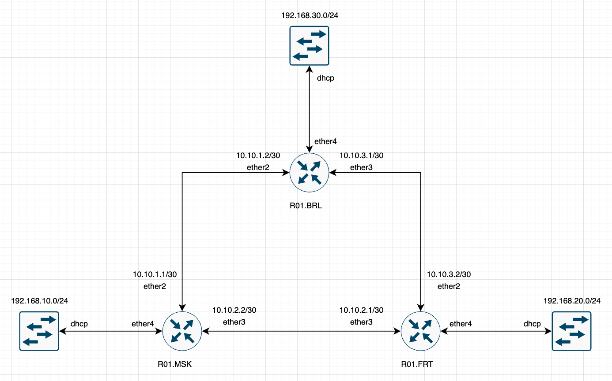

University: [ITMO University](https://itmo.ru/ru/)

Faculty: [FICT](https://fict.itmo.ru)

Course: [Introduction in routing](https://github.com/itmo-ict-faculty/introduction-in-routing)

Year: 2022/2023

Group: K33212

Author: Glebov Ivan Igorevich

Lab: Lab2

Date of create: 10.10.2022

Date of finished: 18.10.2022

# Стартовый конфиг

Стартовый конфиг представлен в файле topology.clab.yml. Файл представляет собой топологию сети и описание каждой ноды с адресом в управляющей сети для подключения. 

Вмето конечных хостов локальных сетей использованы устройства с RouterOS, которые выступают как dhcp-client настроенный на внутренний интерфейс bridge.

## <a name="networkTopology"></a>Топология сети 



## Разворачивание

Первое разворачивание группы контейнеров производится командой `clab deploy`  из директории рядом с файлом `topology.clab.yml`.

Если есть необходимость перезапустить лабораторную работу со сбросом всех устройств и сети, то используется команда `clab deploy --reconfigure`.

# Конфигурация устройств

Конфигурация сети представляет собой кольцо со статической маршрутизацией между пограничными роутерами. Внутри кольца может быть любая удобная нам маршрутизация. Я использовал сети /30 на каждый канал между роутерами и сети /24 для локальных сетей за роутерами. На каждом роутере должен быть представлен vlan его локальной сети и dhcp-server для выдачи адресов внутрь локальной сети. Вместе с этом надо добавить 2 статических маршрута до локальных сетей соседних роутеров. Конфигурация на всех устройствах очень похожая и подробное описание будет приведено только для устройства R01.MSK. R01.BRL и R01.FRT будут описаны коротким списком отличий и полным листингом конфигурации.

## Настройка маршрутизатора R01.MSK

### Настройка vlan

На устройстве надо добавить vlan, которые будет представлять локальную сеть. Это не является обязательным, но рекомендуется.

#### Добавление Vlan

Для добавления данного интерфейса надо воспользоваться следующей командой:

```
interface vlan add interface=ether4 name=vlanMSK vlan-id=10
ip address add address=192.168.10.1/24 interface=vlanMSK
```

Первая команда добавит интерфейс с именем `vlanMSK`, который будет прикреплён к физическому интерфейсу `ether4`. Подробное описание базовых флагов команды приведено в разделе [добавление vlan](https://github.com/IvanGlebov/2022_2023-introduction_in_routing-k33212-glebov_i_i/blob/master/lab1/lab1_report.md#%D0%B4%D0%BE%D0%B1%D0%B0%D0%B2%D0%BB%D0%B5%D0%BD%D0%B8%D0%B5-vlan) первой лабораторной работы. Вторая команда назначит на интерфейс `vlanMSK` адрес `192.168.10.1/24`.

### Настройка адресов интерфейсов

Для последующей настройки статических маршрутов надо на связанные интерфейсы выдать ip адсера согласно разработанной топологии. Для этого надо воспользоваться следующими командами:

```
ip address add address=10.10.1.1/30 interface=ether2
ip address add address=10.10.2.2/30 interface=ether3
```

### Настройка dhcp

Для создания и включения dhcp сервера необходимо выполнить следующие шаги:
- Добавить пул адресов, которые будет выдавать dhcp-server
- Добавить dhcp-server network
- Создать dhcp-server и указать ему интерфейс работы
- Включить dhcp-server

#### Добавление пула адресов

Для добавления пула адресов надо воспользоваться следующей командой:

```
ip pool add name=poolMSK ranges=192.168.10.10-192.168.10.250
```

Эта команда добавит пул адресов от `192.168.10.10` до `192.168.10.250`, который будет иметь название `poolMSK`. 

#### Добавление dhcp-server network

Для добавления сети в dhcp-server networks надо воспользоваться следующей командой:

```
ip dhcp-server network add address=192.168.10.0/24 gateway=192.168.10.1
```

Данная команда добавляет в список сетей сеть `192.168.10.0/24` и указывает, что адрес шлюза по умолчанию будет `192.168.10.1`.

#### Создание dhcp-server и его включение

Для добавления на роутер dhcp-server и включения его надо воспользоваться следующей командой:

```
ip dhcp-server add address-pool=poolMSK disabled=no name=serverMSK interface=vlanMSK
```

Эта команда добавит на маршрутизатор dhcp-server, который будет выдавать адреса из пула `poolMSK` на интерфейс `vlamMSK`. Называться сервер будет `serverMSK`. Чтобы сразу влючить сервер используется флаг `disabled=no`. Для более подробного описания параметров следует обратиться к разделу [создание dhcp-server и его включение](https://github.com/IvanGlebov/2022_2023-introduction_in_routing-k33212-glebov_i_i/blob/master/lab1/lab1_report.md#%D1%81%D0%BE%D0%B7%D0%B4%D0%B0%D0%BD%D0%B8%D0%B5-dhcp-server-%D0%B8-%D0%B5%D0%B3%D0%BE-%D0%B2%D0%BA%D0%BB%D1%8E%D1%87%D0%B5%D0%BD%D0%B8%D0%B5) первой лабораторной работы.

### Настройка статических маршрутов

На каждом маршрутизаторе есть таблица маршрутизации, которая описывает способ добраться до конкретной сети. В данном случае нам нужно добавить в эту таблицу два новых маршрута, которые будут вести в сети R01.FRT и R01.BRL.

Для добавления маршрутов надо воспользоваться следующими командами:

```
ip route add dst-address=192.168.20.0/24 gateway=10.10.2.1
ip route add dst-address=192.168.30.0/24 gateway=10.10.1.2
```

После использования этих команд в таблице маршрутизации станет на 2 записи больше и маршрутизатор будет знать как добраться до указанных сетей.

### Полная конфигурация маршрутизатора R01.MSK

Ниже будет приведён полный вывод команды `/export` для маршрутизатора `R01.MSK`, который можно скопировать в `cli` для клонирования конфигурации.

```
/interface vlan
add interface=ether4 name=vlanMSK vlan-id=10
/interface wireless security-profiles
set [ find default=yes ] supplicant-identity=MikroTik
/ip pool
add name=poolMSK ranges=192.168.10.10-192.168.10.250
/ip dhcp-server
add address-pool=poolMSK disabled=no interface=vlanMSK name=serverMSK
/ip address
add address=172.31.255.30/30 interface=ether1 network=172.31.255.28
add address=192.168.10.1/24 interface=vlanMSK network=192.168.10.0
add address=10.10.1.1/30 interface=ether2 network=10.10.1.0
add address=10.10.2.2/30 interface=ether3 network=10.10.2.0
/ip dhcp-client
add disabled=no interface=ether1
/ip dhcp-server network
add address=192.168.10.0/24 gateway=192.168.10.1
/ip route
add distance=1 dst-address=192.168.20.0/24 gateway=10.10.2.1
add distance=1 dst-address=192.168.30.0/24 gateway=10.10.1.2
/system identity
set name=R01.MSK
```


## Настройка маршрутизатора R01.FRT

Общая идея конфигурации идентичная и отличается только с оглядкой на [топологию](#networkTopology).

### Настройка vlan

Конфигурация vlan на этом маршрутизаторе отличается только названием `vlan`, `vlan-id=20`, а не 10 и адресом на интерфейсе - `192.168.20.1/24`, вместо `192.168.10.1/24`.

#### Листинг конфигурации

```
/interface vlan
add interface=ether4 name=vlanFRT vlan-id=20
/ip address
add address=192.168.20.1/24 interface=vlanFRT network=192.168.20.0
```

### Настройка адресов интерфейсов

Адресация на физических интерфейсах соответствует топологии.

#### Листинг конфигурации

```
/ip address
add address=10.10.2.1/30 interface=ether3 network=10.10.2.0
add address=10.10.3.2/30 interface=ether2 network=10.10.3.0
```

### Настройка dhcp

Конфигурация dhcp-server аналогичная, но используется пул `192.168.20.10-192.168.20.250` и сеть `192.168.20.0/24`. 

#### Листинг конфигурации

```
/ip pool
add name=poolFRT ranges=192.168.20.10-192.168.20.250
/ip dhcp-server
add address-pool=poolFRT disabled=no interface=vlanFRT name=serverFRT
/ip dhcp-server network
add address=192.168.20.0/24 gateway=192.168.20.1
```

### Настройка статических маршрутов

Конфигурация маршрутов отличается с оглядкой на топологию, но логически идентичная.

#### Листинг конфигурации

```
/ip route
add distance=1 dst-address=192.168.10.0/24 gateway=10.10.2.2
add distance=1 dst-address=192.168.30.0/24 gateway=10.10.3.1
```

### Полная конфигурация маршрутизатора R01.FRT

Ниже будет приведён полный вывод команды `/export` для маршрутизатора `R01.FRT`, который можно скопировать в `cli` для клонирования конфигурации.

```
/interface vlan
add interface=ether4 name=vlanFRT vlan-id=20
/interface wireless security-profiles
set [ find default=yes ] supplicant-identity=MikroTik
/ip pool
add name=poolFRT ranges=192.168.20.10-192.168.20.250
/ip dhcp-server
add address-pool=poolFRT disabled=no interface=vlanFRT name=serverFRT
/ip address
add address=172.31.255.30/30 interface=ether1 network=172.31.255.28
add address=192.168.20.1/24 interface=vlanFRT network=192.168.20.0
add address=10.10.2.1/30 interface=ether3 network=10.10.2.0
add address=10.10.3.2/30 interface=ether2 network=10.10.3.0
/ip dhcp-client
add disabled=no interface=ether1
/ip dhcp-server network
add address=192.168.20.0/24 gateway=192.168.20.1
/ip route
add distance=1 dst-address=192.168.10.0/24 gateway=10.10.2.2
add distance=1 dst-address=192.168.30.0/24 gateway=10.10.3.1
/system identity
set name=R01.FRT
```


## Настройка маршрутизатора R01.BRL

Общая идея конфигурации идентичная и отличается только с оглядкой на [топологию](#networkTopology).

### Настройка vlan

Конфигурация vlan на этом маршрутизаторе отличается только названием `vlan`, `vlan-id=30`, а не 10 и адресом на интерфейсе - `192.168.30.1/24`, вместо `192.168.10.1/24`.

#### Листинг конфигурации

```
/interface vlan
add interface=ether4 name=vlanBRL vlan-id=30
/ip address
add address=192.168.30.1/24 interface=vlanBRL network=192.168.30.0
```

### Настройка адресов интерфейсов

Адресация на физических интерфейсах соответствует топологии.

#### Листинг конфигурации

```
/ip address
add address=10.10.1.2/30 interface=ether2 network=10.10.1.0
add address=10.10.3.1/30 interface=ether3 network=10.10.3.0
```

### Настройка dhcp

Конфигурация dhcp-server аналогичная, но используется пул `192.168.30.10-192.168.30.250` и сеть `192.168.30.0/24`. 

#### Листинг конфигурации

```
/ip pool
add name=poolBRL ranges=192.168.30.10-192.168.30.250
/ip dhcp-server
add address-pool=poolBRL disabled=no interface=vlanBRL name=serverBRL
/ip dhcp-server network
add address=192.168.30.0/24 gateway=192.168.30.1
```

### Настройка статических маршрутов

Конфигурация маршрутов отличается с оглядкой на топологию, но логически идентичная.

#### Листинг конфигурации

```
/ip route
add distance=1 dst-address=192.168.10.0/24 gateway=10.10.1.1
add distance=1 dst-address=192.168.20.0/24 gateway=10.10.3.2
```

### Полная конфигурация маршрутизатора R01.FRT

Ниже будет приведён полный вывод команды `/export` для маршрутизатора `R01.FRT`, который можно скопировать в `cli` для клонирования конфигурации.

```
/interface vlan
add interface=ether4 name=vlanBRL vlan-id=30
/interface wireless security-profiles
set [ find default=yes ] supplicant-identity=MikroTik
/ip pool
add name=poolBRL ranges=192.168.30.10-192.168.30.250
/ip dhcp-server
add address-pool=poolBRL disabled=no interface=vlanBRL name=serverBRL
/ip address
add address=172.31.255.30/30 interface=ether1 network=172.31.255.28
add address=192.168.30.1/24 interface=vlanBRL network=192.168.30.0
add address=10.10.1.2/30 interface=ether2 network=10.10.1.0
add address=10.10.3.1/30 interface=ether3 network=10.10.3.0
/ip dhcp-client
add disabled=no interface=ether1
/ip dhcp-server network
add address=192.168.30.0/24 gateway=192.168.30.1
/ip route
add distance=1 dst-address=192.168.10.0/24 gateway=10.10.1.1
add distance=1 dst-address=192.168.20.0/24 gateway=10.10.3.2
/system identity
set name=R01.BRL
```