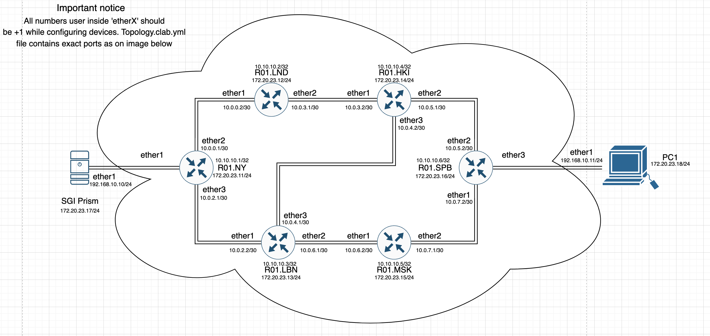
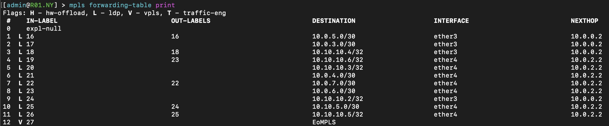
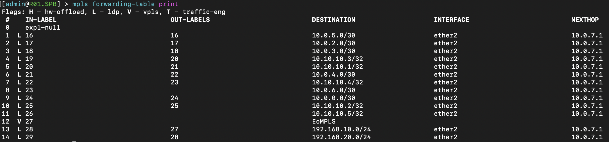
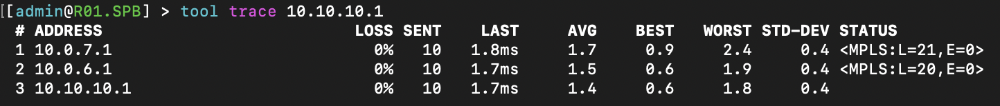
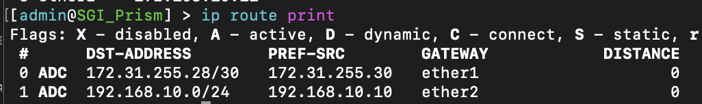
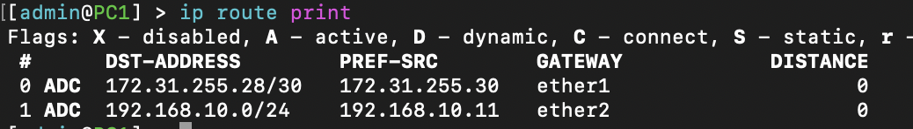

University: [ITMO University](https://itmo.ru/ru/)

Faculty: [FICT](https://fict.itmo.ru)

Course: [Introduction in routing](https://github.com/itmo-ict-faculty/introduction-in-routing)

Year: 2022/2023

Group: K33212

Author: Glebov Ivan Igorevich

Lab: Lab2

Date of create: 25.10.2022

Date of finished: 06.12.2022

# Стартовый конфиг

Стартовый конфиг представлен в файле topology.clab.yml. Файл представляет собой топологию сети и описание каждой ноды с адресом в управляющей сети для подключения. 

Вмето конечных хостов локальных сетей использованы устройства с RouterOS, на которых настроена адресация только для портов, которые смотрят в сеть.
## Топология сети



## Разворачивание

Первое разворачивание группы контейнеров производится командой `clab deploy`  из директории рядом с файлом `topology.clab.yml`.

Если есть необходимость перезапустить лабораторную работу со сбросом всех устройств и сети, то используется команда `clab deploy --reconfigure`.

# Конфигурация устройств

Конфигурация сети представляет 2 конечных устройства, 2 пограничных роутера с EoMPLS и 4 промежуточных роутера с MPLS. Внутренняя адресация между устройствами и адреса для Loopback интерфейсов будут выдаваться из сетей вида 10.0.x.x/30 и 10.10.10.x/32 соответственно. Внутренняя маршрутизация будет проводиться по OSPF и MPLS. На устройствах R01.NY и R01.SPB помимо OSPF и MPLS надо настроить EoMPLS туннель от интерфейса ether1 у R01.NY до ether3 у R01.SPB. Устройства R01.LND, R01.LBN, R01.HKI и R01.MSK должны содержать настройки только для работы с OSPF и MPLS. В связи с этим подробные конфигурации будут приведены только для устройств R01.NY и R01.LBN, так как остальные будут повторять их и подробное пояснение будет излишним.

## Настройка маршрутизатора R01.NY

## Добавление Loopback интерфейса

Для обеспечения бесперебойной работы OSPF и MPLS будет использовать Loopback интерфейс для их "привязки". Этот интерфейс не будет спонтанно отключаться и это позволит защитить сеть от неожиданного поведения при отключении OSPF или MPLS на одном из маршрутизаторов. Эта конфигурация должна быть выполнена на каждом устройства и адрес Loopback необходимо выбрать уникальным. Для добавления такого интерфейса надо воспользоваться следующей командой:

```
interface bridge add name=loopback
```

### Настройка адресов интерфейсов

Для задуманной сети необходимо выдать адреса на порты, которые смотрят во внутренности сети и адрес на Loopback интерфейс. Для этого надо воспользоваться следующими командами:
```
ip address add address=10.0.0.1/30 interface=ether3 network=10.0.0.0
ip address add address=10.0.2.1/30 interface=ether4 network=10.0.2.0
ip address add address=10.10.10.1 interface=loopback network=10.10.10.1
```

### Включение OSPF

Для запуска динамической маршрутизации необходимо выполнить следующие команды:

```
routing ospf instance set 0 router-id=10.10.10.1
routing ospf network add area=backbone
```

После выполнения этих команд маршрутизатор начнёт строить таблицу маршрутизации и при правильной конфигурации соседних маршрутизаторов у него должна получиться полная таблица маршрутизации.

### Включение MPLS

Для запуска маршрутизации по метками необходимо выполнить следующие команды:

```
mpls ldp set enabled=yes transport-address=10.10.10.1
mpls ldp interface add interface=ether3
mpls ldp interface add interface=ether4
```

Важно помнить, что интерфейсы должны смотреть внутрь MPLS сети, а transport-address должен быть раверн адресу loopback интерфейса для обеспечения бесперебойной работы.

### Конфигурация EoMPLS

Последняя деталь конфигурации этого устройства будет заключаться в конфигурации EoMPLS для устройства SGI_Prism, которое подключено через порт ether2. Для этого необходимо выполнить следующие команды:

```
interface bridge add name=EoMPLS_bridge
interface vpls add cisco-style=yes cisco-style-id=222 disabled=no name=EoMPLS remote-peer=10.10.10.6
interface bridge port add bridge=EoMPLS_bridge interface=ether2
interface bridge port add bridge=EoMPLS_bridge interface=EoMPLS
```

Первой командой мы создаём bridge, который будет коммутировать трафик физического порта и виртуального vpls интерфейса. 
После этого мы создаём vpls интерфейс. У него можно отметить следующий набор флагов:
- cisco-style=yes - флаг указывает на то, что id будет указан так, как это делается на устройствах cisco
- cisco-style-id=222 - id vpls интерфейса. Он должен быть одинаковым у соединяемых vpls интерфейсов
- disabled=no - флаг включения/выключения интерфейса
- name=EoMPLS - название интерфейса
- remote-peer=10.10.10.6 - ip адрес, который был указан у второго устройства в поле `transport-address`. В данном случае это ip интерфейса loopback у R01.SPB.
На этом этапе конфигурация R01.NY закончена. 

### Таблица маршрутизации по меткам
После настройки всех устройств и построения MPLS сети мы можем посмотреть MPLS-метки маршрутизации командой `mpls forwarding-table print`:

 

### Трассировака от R01.NY до R01.SPB


В правой части изображения можно наблюдать информацию об MPLS метках


### Полная конфигурация R01.NY

```
/interface bridge
add name=EoMPLS_bridge
add name=loopback
/interface vpls
add cisco-style=yes cisco-style-id=222 disabled=no l2mtu=1500 mac-address=02:90:6A:B9:96:C8 name=EoMPLS remote-peer=10.10.10.6
/interface wireless security-profiles
set [ find default=yes ] supplicant-identity=MikroTik
/routing ospf instance
set [ find default=yes ] router-id=10.10.10.1
/interface bridge port
add bridge=EoMPLS_bridge interface=ether2
add bridge=EoMPLS_bridge interface=EoMPLS
/ip address
add address=172.31.255.30/30 interface=ether1 network=172.31.255.28
add address=10.0.0.1/30 interface=ether3 network=10.0.0.0
add address=10.0.2.1/30 interface=ether4 network=10.0.2.0
add address=10.10.10.1 interface=loopback network=10.10.10.1
/ip dhcp-client
add disabled=no interface=ether1
/mpls ldp
set enabled=yes transport-address=10.10.10.1
/mpls ldp interface
add interface=ether3
add interface=ether4
/routing ospf network
add area=backbone
/system identity
set name=R01.NY
```

## Конфигурация маршрутизатора R01.SPB

Как было сказано ранее - конфигурация этого устройства аналогична конфигурации R01.NY и отличается только адресами, которые выдаются на интерфейсы. В силу этого подробного разъяснения конфигурации прведено не будет.

### Полная конфигурация R01.SPB

```
/interface bridge
add name=EoMPLS_bridge
add name=loopback
/interface vpls
add cisco-style=yes cisco-style-id=222 disabled=no l2mtu=1500 mac-address=02:63:6E:00:C0:75 name=EoMPLS remote-peer=10.10.10.1
/interface wireless security-profiles
set [ find default=yes ] supplicant-identity=MikroTik
/routing ospf instance
set [ find default=yes ] router-id=10.10.10.6
/interface bridge port
add bridge=EoMPLS_bridge interface=ether4
add bridge=EoMPLS_bridge interface=EoMPLS
/ip address
add address=172.31.255.30/30 interface=ether1 network=172.31.255.28
add address=10.0.7.2/30 interface=ether2 network=10.0.7.0
add address=10.10.5.2/30 interface=ether3 network=10.10.5.0
add address=10.10.10.6 interface=loopback network=10.10.10.6
/ip dhcp-client
add disabled=no interface=ether1
/mpls ldp
set enabled=yes transport-address=10.10.10.6
/mpls ldp interface
add interface=ether2
add interface=ether3
add interface=ether4
/routing ospf network
add area=backbone
/system identity
set name=R01.SPB
```

### Таблица маршрутизации по меткам



### Трассировка от R01.SPB до R01.NY


 В правой части изображения можно наблюдать информацию об MPLS метках

## Конфигурация маршрутизатора R01.LBN

Конфигурация этого устройства содержит в себе настройки аналогичные пунктам 1-4 у R01.NY и подробности будут опущены. Дополнительной конфигурации поверх этого не требуется.

### Полная конфигурация R01.LBN

``` 
/interface bridge
add name=loopback
/interface wireless security-profiles
set [ find default=yes ] supplicant-identity=MikroTik
/routing ospf instance
set [ find default=yes ] router-id=10.10.10.3
/ip address
add address=172.31.255.30/30 interface=ether1 network=172.31.255.28
add address=10.0.2.2/30 interface=ether2 network=10.0.2.0
add address=10.0.6.1/30 interface=ether3 network=10.0.6.0
add address=10.0.4.1/30 interface=ether4 network=10.0.4.0
add address=10.10.10.3 interface=loopback network=10.10.10.3
/ip dhcp-client
add disabled=no interface=ether1
/mpls ldp
set enabled=yes transport-address=10.10.10.3
/mpls ldp interface
add interface=ether2
add interface=ether3
add interface=ether4
/routing ospf network
add area=backbone
/system identity
set name=R01.LBN
```

## Конфигурация маршрутизатора R01.LND

Конфигурация устройства аналогична с R01.LBN и подробности будут опущены.

### Полная конфигурация устройства

```
/interface bridge
add name=loopback
/interface wireless security-profiles
set [ find default=yes ] supplicant-identity=MikroTik
/routing ospf instance
set [ find default=yes ] router-id=10.10.10.2
/ip address
add address=172.31.255.30/30 interface=ether1 network=172.31.255.28
add address=10.0.0.2/30 interface=ether2 network=10.0.0.0
add address=10.0.3.1/30 interface=ether3 network=10.0.3.0
add address=10.10.10.2 interface=loopback network=10.10.10.2
/ip dhcp-client
add disabled=no interface=ether1
/mpls ldp
set enabled=yes transport-address=10.10.10.2
/mpls ldp interface
add interface=ether2
add interface=ether3
/routing ospf network
add area=backbone
/system identity
set name=R01.LND
```

## Конфигурация маршрутизатора R01.HKI

Конфигурация устройства аналогична с R01.LBN и подробности будут опущены.

### Полная конфигурация устройства

```
/interface bridge
add name=loopback
/interface wireless security-profiles
set [ find default=yes ] supplicant-identity=MikroTik
/routing ospf instance
set [ find default=yes ] router-id=10.10.10.4
/ip address
add address=172.31.255.30/30 interface=ether1 network=172.31.255.28
add address=10.0.3.2/30 interface=ether2 network=10.0.3.0
add address=10.0.5.1/30 interface=ether3 network=10.0.5.0
add address=10.0.4.2/30 interface=ether4 network=10.0.4.0
add address=10.10.10.4 interface=loopback network=10.10.10.4
/ip dhcp-client
add disabled=no interface=ether1
/mpls ldp
set enabled=yes transport-address=10.10.10.4
/mpls ldp interface
add interface=ether2
add interface=ether3
add interface=ether4
/routing ospf network
add area=backbone
/system identity
set name=R01.HKI
```

## Конфигурация маршрутизатора R01.MSK

Конфигурация устройства аналогична с R01.LBN и подробности будут опущены.

### Полная конфигурация устройства

```
/interface bridge
add name=loopback
/interface wireless security-profiles
set [ find default=yes ] supplicant-identity=MikroTik
/routing ospf instance
set [ find default=yes ] router-id=10.10.10.5
/ip address
add address=172.31.255.30/30 interface=ether1 network=172.31.255.28
add address=10.0.6.2/30 interface=ether2 network=10.0.6.0
add address=10.0.7.1/30 interface=ether3 network=10.0.7.0
add address=10.10.10.5 interface=loopback network=10.10.10.5
/ip dhcp-client
add disabled=no interface=ether1
/mpls ldp
set enabled=yes transport-address=10.10.10.5
/mpls ldp interface
add interface=ether2
add interface=ether3
/routing ospf network
add area=backbone
/system identity
set name=R01.MSK
```

## Конфигурация устройства SGI_Prism

Конфигурация устройства заключается лишь в добавлении на физический интерфейс адреса. Для этого надо воспользоваться командой: 

```
ip address add address=192.168.10.10/24 interface=ether2 network=192.168.10.0
```

После построения сети и установления адресов на интерфейсах SGI_Prism и PC1 вывод таблицы маршрутизации будет следующим:



### Полная конфигурация устройства SGI_Prism

```
/interface wireless security-profiles
set [ find default=yes ] supplicant-identity=MikroTik
/ip address
add address=172.31.255.30/30 interface=ether1 network=172.31.255.28
add address=192.168.10.10/24 interface=ether2 network=192.168.10.0
/ip dhcp-client
add disabled=no interface=ether1
/system identity
set name=SGI_Prism
```

## Конфигурация устройства PC1

Конфигурация устройства заключается лишь в добавлении на физический интерфейс адреса и аналогична устройству SGI_Prism. Для этого надо воспользоваться командой: 

```
ip address add address=192.168.10.11/24 interface=ether2 network=192.168.10.0
```

После построения сети и установления адресов на интерфейсах SGI_Prism и PC1 вывод таблицы маршрутизации будет следующим:



### Полная конфигурация устройства PC1

```
/interface wireless security-profiles
set [ find default=yes ] supplicant-identity=MikroTik
/ip address
add address=172.31.255.30/30 interface=ether1 network=172.31.255.28
add address=192.168.10.11/24 interface=ether2 network=192.168.10.0
/ip dhcp-client
add disabled=no interface=ether1
/system identity
set name=PC1
```